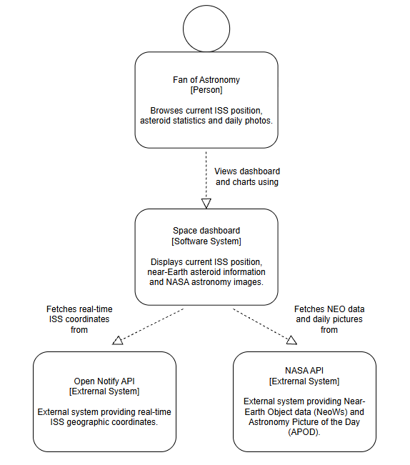
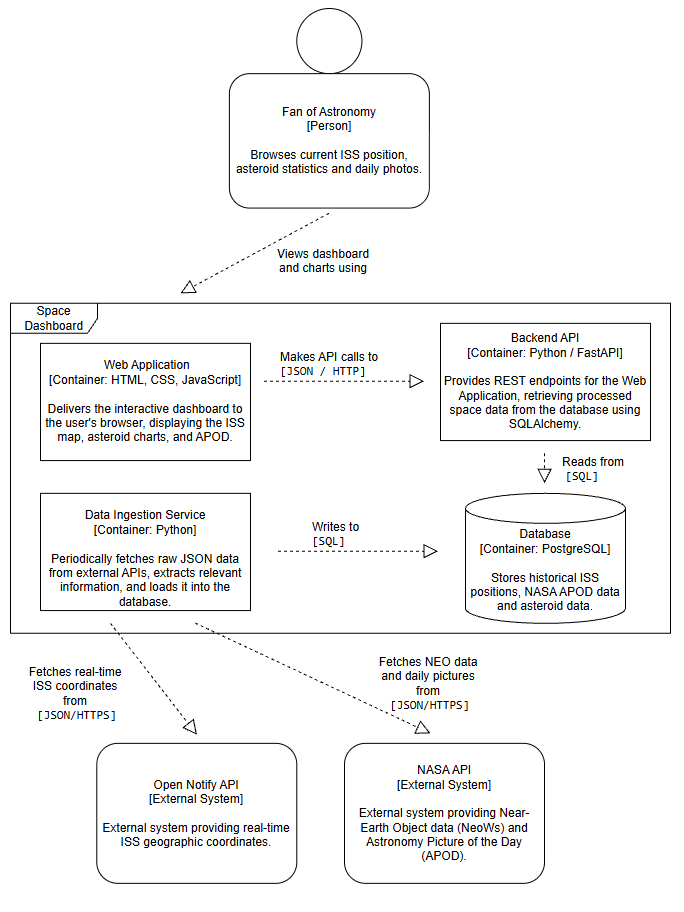
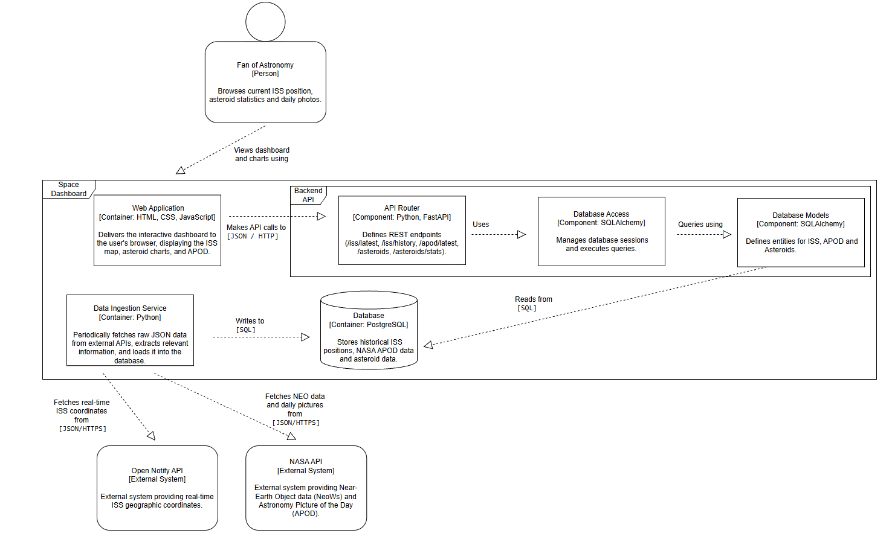
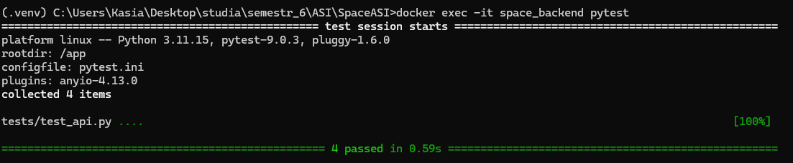
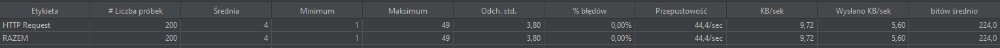

# Space Dashboard (Kosmiczny Dashboard)

Celem projektu było zaprojektowanie architektury warstwowej z wyrażnym podziałem odpowiedzialności poniędzy poszczególne komponenty, a następnie jego implementacja.

Space Dashboard to aplikacja webowa prezentująca wybrane dane kosmiczne w czasie rzeczywistym. System integruje informacje o bliskich przelotach asteroid, aktualnej pozycji Międzynarodowej Stacji Kosmicznej (ISS) oraz codziennie dostarcza astronomiczne zdjęcia NASA, prezentując je na interaktywnym dashboardzie.

---

# Wykorzystane źródła danych

Dane pobierane są z następujących źródeł:

## 1. NASA APOD (Astronomy Picture of the Day)

https://api.nasa.gov/

Źródło dostarczające codzienne astronomiczne zdjęcie wraz z opisem naukowym.

Pobierane dane:
- tytuł zdjęcia,
- adres obrazu,
- opis,
- data publikacji.

---

## 2. NASA NeoWs (Near Earth Object Web Service)

https://api.nasa.gov/

Źródło danych o asteroidach bliskich Ziemi.

Pobierane dane:
- nazwa obiektu,
- średnica,
- prędkość,
- odległość od Ziemi,
- status zagrożenia,
- data zbliżenia.

System pobiera dane dla zakresu:

```text
dzisiaj → +7 dni
```

Każde zbliżenie traktowane jest jako osobne zdarzenie.

---

## 3. Open Notify API (ISS Location Now)

http://open-notify.org/Open-Notify-API/ISS-Location-Now/

Źródło aktualnej pozycji Międzynarodowej Stacji Kosmicznej.

Pobierane dane:
- szerokość geograficzna,
- długość geograficzna.

---


# Architektura systemu i technologie

System został zaprojektowany jako aplikacja wielowarstwowa. Poniżej znajdują się diagramy C4 (Context, Container, Component) oraz opis architektury.

### Context Diagram

### Container Diagram

### Component Diagram



## Data Ingestion

Niezależny proces Python odpowiedzialny za pobieranie danych z zewnętrznych API.

Częstotliwość aktualizacji:

| Dane | Częstotliwość |
|---|---|
| ISS | co 5 sekund |
| APOD | przy starcie + co 24 godziny |
| Asteroidy | przy starcie + co 24 godziny |

Proces zapisuje dane do bazy danych i ogranicza liczbę zapytań do zewnętrznych API.

---

## Baza danych

W projekcie wykorzystano:

```text
PostgreSQL 16
```

uruchamiany w kontenerze Docker.

Dane przechowywane są historycznie.

Retencja danych:

| Tabela | Zawartość | Retencja |
|---|---|---|
| iss_positions | historia pozycji ISS | ostatnie 5000 punktów |
| apod | zdjęcia dnia NASA | ostatnie 30 rekordów |
| asteroids | dane asteroid | ostatnie 30 dni |


---

## Backend

Technologie:

```text
Python
FastAPI
SQLAlchemy
```

Backend udostępnia REST API dla frontendu.

Dostępne endpointy:

```http
GET /iss/latest
GET /iss/history
GET /apod/latest
GET /asteroids
GET /asteroids/stats
```

Opis endpointów:

| Endpoint | Opis |
|---|---|
| /iss/latest | aktualna pozycja ISS |
| /iss/history | historia pozycji ISS |
| /apod/latest | ostatnie zdjęcie NASA |
| /asteroids | wszystkie zapisane zbliżenia asteroid |
| /asteroids/stats | statystyki unikalnych zbliżeń |

Frontend komunikuje się wyłącznie z backendem.

---

## Frontend

Technologie:

```text
HTML5
JavaScript
Chart.js
Leaflet.js
```

Dashboard prezentuje:

- aktualną pozycję ISS,
- historyczny ślad ruchu ISS,
- zdjęcie dnia NASA,
- tabelę asteroid,
- wykres prędkości asteroid,
- wykres odległości asteroid.

Mapa:
- odświeżanie pozycji ISS co 5 sekund,
- sprawdza, ciągłość danych,
- możliwość przybliżania,
- zapamiętywanie ostatniego położenia i zoomu po odświeżeniu strony.

Tabela asteroid:
- prezentuje 10 najbliższych zbliżeń.

Wykresy:
- prędkość asteroid,
- odległość asteroid,
- wyróżnienie niebezpiecznych obiektów.

Statystyki:

- Total - liczba zbliżeń,
- Dangerous - liczba niebezpiecznych zbliżeń,
- zakres dat zapisanych danych (dane z najbliższego tygodnia).

---

## Uzasadnienie zastosowanych technologii

### HTML, CSS, JavaScript (Frontend)

Technologie frontendowe zostały wybrane ze względu na prostotę implementacji oraz możliwość stworzenia lekkiego, interaktywnego dashboardu dostępnego z poziomu przeglądarki bez konieczności instalowania dodatkowego oprogramowania.

- HTML – struktura interfejsu użytkownika,
- CSS – stylizacja i układ strony,
- JavaScript – pobieranie danych z API oraz dynamiczna aktualizacja widoków.

---

### FastAPI (Backend API)

FastAPI zostało wybrane ze względu na:
- szybkie tworzenie REST API,
- automatyczne generowanie dokumentacji Swagger/OpenAPI,
- prostą integrację z Pythonem,
- wysoką wydajność i czytelną składnię.

Framework odpowiada za udostępnianie endpointów oraz komunikację pomiędzy frontendem i bazą danych.

---

### Python (Data Ingestion)

Python został wykorzystany do implementacji modułu akwizycji danych ze względu na:
- prostą obsługę zapytań HTTP,
- łatwe przetwarzanie danych JSON.

Serwis odpowiada za cykliczne pobieranie i przetwarzanie danych z zewnętrznych źródeł.

---

### PostgreSQL (Baza danych)

PostgreSQL został wybrany jako relacyjna baza danych ze względu na:
- stabilność i niezawodność,
- obsługę większych zbiorów danych historycznych,
- łatwą integrację z SQLAlchemy,
- możliwość trwałego przechowywania danych.

Baza przechowuje historię pozycji ISS, dane APOD oraz informacje o asteroidach.

---

### SQLAlchemy (Warstwa dostępu do danych)

SQLAlchemy zostało wykorzystane jako warstwa dostępu do danych, ponieważ:
- upraszcza komunikację z bazą danych,
- pozwala operować na obiektach zamiast ręcznie pisać zapytania SQL,
- zwiększa czytelność i łatwość utrzymania kodu.

---

### Docker i Docker Compose (Środowisko uruchomieniowe)

Docker został wykorzystany do konteneryzacji aplikacji, co umożliwia:
- uruchamianie projektu w identycznym środowisku na różnych komputerach,
- łatwe wdrażanie,
- izolację zależności.

Docker Compose umożliwia zarządzanie wieloma usługami projektu (frontend, backend, baza danych, ingestion) z poziomu jednej konfiguracji.

---

# Środowisko uruchomieniowe

Aplikacja została skonteneryzowana przy użyciu technologii Docker i Docker Compose.

Projekt udostępnia oddzielne konfiguracje dla:
- środowiska deweloperskiego,
- środowiska testowego,
- środowiska produkcyjnego.

# Dokumentacja API

Interaktywna dokumentacja REST API dostępna jest pod adresem:

```text
http://localhost:8000/docs
```

Dokumentacja generowana jest automatycznie przez FastAPI (Swagger UI).

---


# Uruchomienie projektu

1. Sklonuj repozytorium:

```bash
git clone <repo_url>
cd SpaceASI
```

2. Utwórz plik `.env`.

3. Uruchom środowisko:

```bash
docker compose -f docker-compose.yml -f docker-compose.prod.yml up --build
```

# Konfiguracja

Utwórz plik:

```text
.env
```

i uzupełnij:

```env
NASA_API_KEY=...

DATABASE_URL=postgresql://postgres:password@db:5432/space_db

POSTGRES_USER=postgres
POSTGRES_PASSWORD=password
POSTGRES_DB=space_db
```

Plik `.env` nie powinien być commitowany do repozytorium.

## Środowiska

### Development

```bash
docker compose -f docker-compose.yml -f docker-compose.dev.yml up --build
```

### Test

- korzysta z publicznego klucza:

```text
DEMO_KEY
```

- nie wymaga używania prywatnego klucza API,
- pozwala testować integrację z publicznymi usługami.


```bash
docker compose -f docker-compose.yml -f docker-compose.test.yml up --build
```

### Production

```bash
docker compose -f docker-compose.yml -f docker-compose.prod.yml up --build
```

Aktywne środowisko można sprawdzić pod adresem:

```text
http://localhost:8000
```

Przykładowa odpowiedź:

```json
{
  "service": "Space Dashboard API",
  "status": "running",
  "environment": "development",
  "docs": "/docs"
}
```

# Logi

System wykorzystuje logowanie aplikacyjne realizowane przy użyciu modułu `logging` oraz logów kontenerów Docker.

Logi wykorzystywane są do:
- monitorowania aktualizacji danych,
- diagnostyki błędów połączeń z zewnętrznymi API,
- debugowania działania aplikacji.

Podgląd logów:

```bash
docker logs space_backend
docker logs space_ingestion
```

Przykład zarejestrowanego logu:

```text
INFO | ISS updated
ERROR | ISS ERROR: Connection refused
```

---


# Testy

### Testy jednostkowe

Do testowania wykorzystano bibliotekę:

```text
pytest
```

Uruchomienie:

```bash
docker exec -it space_backend pytest
```

Zakres testów:

- dostępność API,
- endpoint `/`,
- endpoint `/iss/latest`,
- endpoint `/apod/latest`,
- endpoint `/asteroids`.

Poniższy obrazek potwierdza pozytywny wynik przeprowadzonych testów.



### Testy wydajnościowe

Do testowania wydajności wykorzystano narzędzie:

```text
Apache JMeter
```

Konfiguracja testu:
- 10 równoległych użytkowników,
- 20 iteracji,
- łącznie 200 żądań,
- testowany endpoint: `GET /iss/latest`.

Wyniki:
- średni czas odpowiedzi: **4 ms**,
- liczba błędów: **0%**,
- przepustowość: **44,4 żądań/s**.

Poniższy obrazek przedstawia wyniki testu wydajnościowego.



System poprawnie obsłużył równoległe zapytania bez błędów i utrzymał niski czas odpowiedzi.

### Podział pracy
- Katarzyna Skoczylas: środowisko Docker, testy jednostkowe i wydajnościowe, Backend, dokumentacja
- Aleksandra Zawadka: Frontend, Swagger, Data Ingestion, dokumentacja
